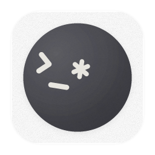

# 🍎 MBP4_Terminal_Setup

Otty 终端下的一键 macOS 环境配置脚本：**Zsh + Starship + 语法高亮**。在新 Mac 上跑一次，几分钟内配好整套终端环境。

<p align="center">
  
  &nbsp;&nbsp;
  
  &nbsp;&nbsp;
  
</p>

<p align="center">
  
</p>

> demo 动图来自原项目 terminal-setup，展示的是完整版终端效果（含 btop 等工具），本仓库只保留了 Zsh + Starship + 语法高亮这部分。

## 工具栈

| 组件 | 说明 |
|------|------|
| **Zsh** | macOS 自带，不需要额外安装 shell 本体 |
| **Starship** | 跨 Shell 提示符，配色用的 Catppuccin Mocha |
| **zsh-autosuggestions** | 输入时灰色显示历史命令建议 |
| **zsh-syntax-highlighting** | 命令语法高亮 |
| **zsh-completions** | 补全增强 |
| **MesloLGS NF** | Nerd Font，Starship 图标需要它 |

## 快速开始

```bash
git clone https://github.com/IBM668/MBP4_Terminal_Setup.git
cd MBP4_Terminal_Setup
./setup.sh
```

脚本会自动：Homebrew → Starship → 三个 zsh 插件 → MesloLGS NF 字体 → 部署 `.zshrc` / `starship.toml`（已有文件自动备份成 `.bak.<时间戳>`）→ 切换默认 shell 为 zsh。

装完后在 Otty 设置里把字体切成 **MesloLGS NF**，重开一个窗口即可生效。脚本幂等，可以重复运行。

## 更新配置

```bash
cd MBP4_Terminal_Setup
git pull
./setup.sh
```

反向同步（本机改了配置想存回仓库）：

```bash
cp ~/.zshrc configs/.zshrc
cp ~/.config/starship.toml configs/starship.toml
git add -A && git commit -m "update config"
git push
```

## 目录结构

MBP4_Terminal_Setup/

├── README.md

├── setup.sh

├── assets/

│   ├── otty.png

│   ├── zsh.png

│   ├── starship.png

│   └── demo-2x.gif

└── configs/

├── .zshrc

└── starship.toml


## License

MIT
